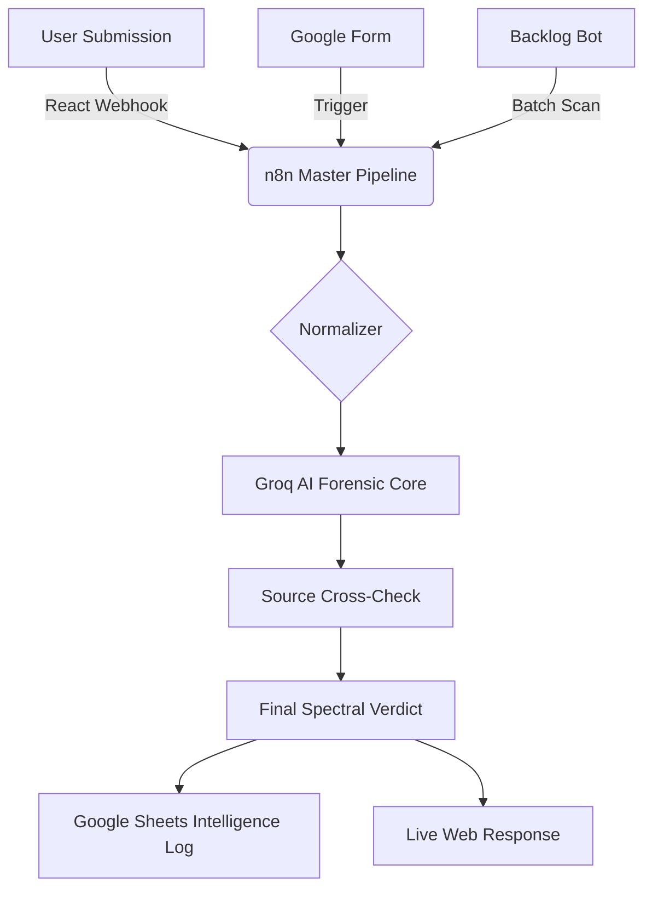

# 🛡️ FakeShield AI: Forensic Intelligence Terminal

[](https://fake-ai-news-detector.vercel.app/)
[](https://reactjs.org/)
[](https://n8n.io/)
[](https://groq.com/)

**FakeShield AI** is a next-generation forensic news analysis platform designed to combat misinformation using advanced AI pattern matching and real-time source cross-verification. It transforms standard news verification into a high-impact "Intelligence Terminal" experience.

---

## 📸 Intelligence Gallery

### 🖥️ Forensic Analyzer (Web UI)

*Modern, glassmorphic terminal interface with real-time scanner animations.*

### ⚙️ Master Ecosystem (n8n Workflow)

*Multi-trigger pipeline handling Webhooks, Google Forms, and 100+ Article Backlog processing.*

---

## 🚀 Key Features

### 📡 Spectrum Verdicts (Confidence Spectrum)
Unlike traditional binary "Real/Fake" tools, FakeShield provides a **nuanced 5-level verdict system**:
- `VERIFIED REAL` | `LIKELY REAL` | `SUSPICIOUS` | `LIKELY FAKE` | `CONFIRMED FAKE`

### 🔍 Source Verification Radar
The terminal explicitly identifies and categorizes sources reporting the news:
- **Trusted Organizations**: Verified against a database of global agencies (Reuters, BBC, AP).
- **Suspicious Entities**: Flagged for propaganda patterns or lack of citation history.

### 🧠 Forensic AI Pattern Detection
Utilizing **Llama 3.1 via Groq**, the engine analyzes:
- **Linguistic Signatures**: Detecting AI-generated vs. Human-authored text.
- **Emotional Bias Sensor**: Identifying high-manipulation sentiment patterns.
- **Evidence Matrix**: A side-by-side breakdown of "Green Flags" (Authenticity) vs. "Red Flags" (Deception).

---

## 🛠️ Tech Stack & Architecture

- **Frontend**: React.js with Premium Glassmorphism UI & Framer Motion animations.
- **Automation Core**: n8n (Node-based workflow automation).
- **AI Inference**: Groq Cloud (Llama 3.1 8B/70B) for sub-second analysis.
- **Database**: Google Sheets (used as a live intelligence log for 100+ articles).
- **Integrations**: Webhooks, Google Forms, and Direct API Links.

---

## 📂 System Architecture



---

## ⚡ Quick Start

1. **Clone the Repo**:
   ```bash
   git clone https://github.com/divyansha12/Fake-AI-news-detector.git
   ```
2. **Install Dependencies**:
   ```bash
   npm install
   ```
3. **Run Local Terminal**:
   ```bash
   npm run dev
   ```

---

## 🛡️ Sentinel Mission
*Our mission is to provide transparency in an era of digital deception. FakeShield isn't just a detector; it's a forensic gateway to the truth.*

**Built for the 2024 Hackathon Excellence.** 🚀🛡️🤖
